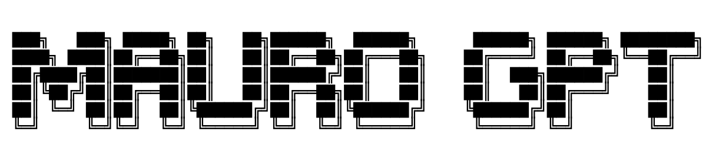

# Mauro GPT

The MauroGPT project is designed to facilitate server operations using Docker and Node.js. This project includes a Docker configuration to build and run your Node.js applications in a containerized environment. The backend utilizes Express.js for server operations and incorporates the Ollama library for additional functionalities.

## Features

- *Docker Integration:* Simplified deployment using Docker containers.
- *Node.js Backend:* Utilizes Express.js for handling server operations.
- *Ollama Library:* Leverages Ollama for serving, listing, and pulling specific functionalities.

## Prerequisites

- Docker
- Node.js

## Installation

- `git clone [repository-url]`
- `cd maurogpt`
- `sh local.sh`
- `https://localhost:8080`

## License

This project is licensed under the ISC license.

Feel free to modify and customize this chat interface according to your needs!

